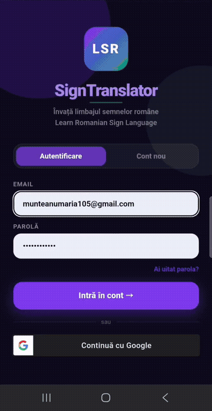
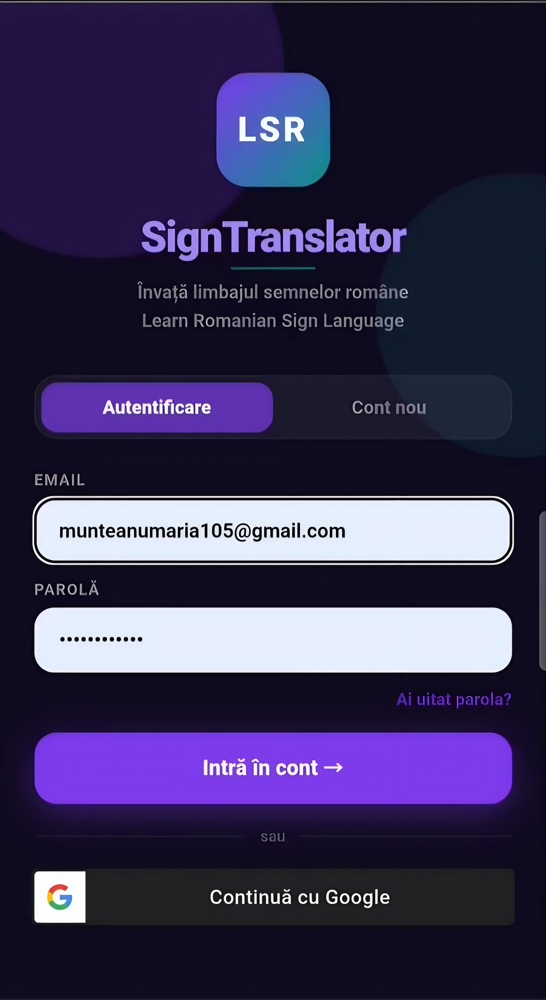
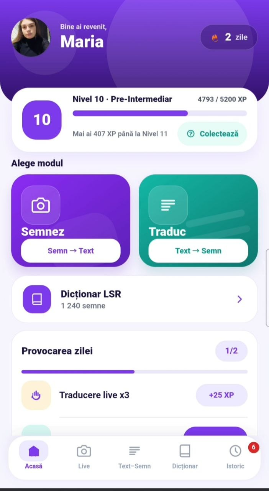
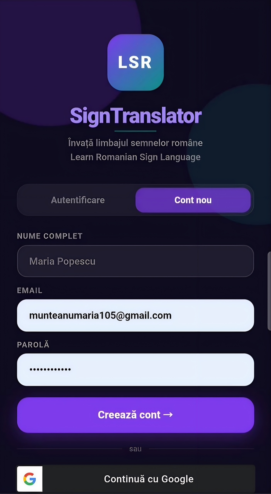
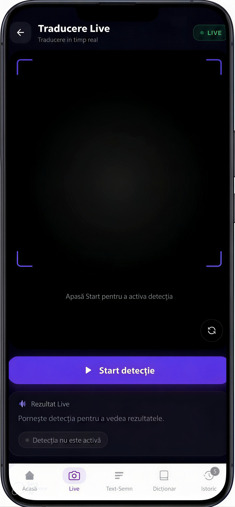
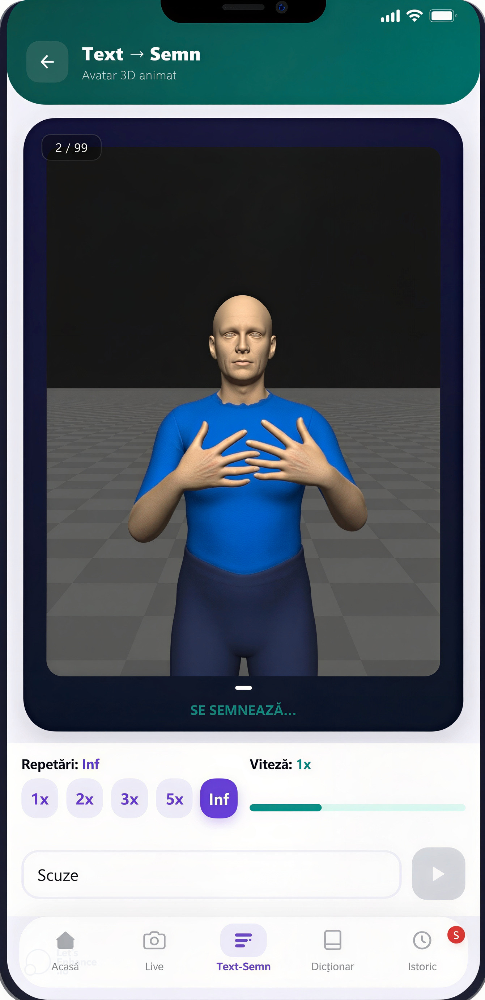
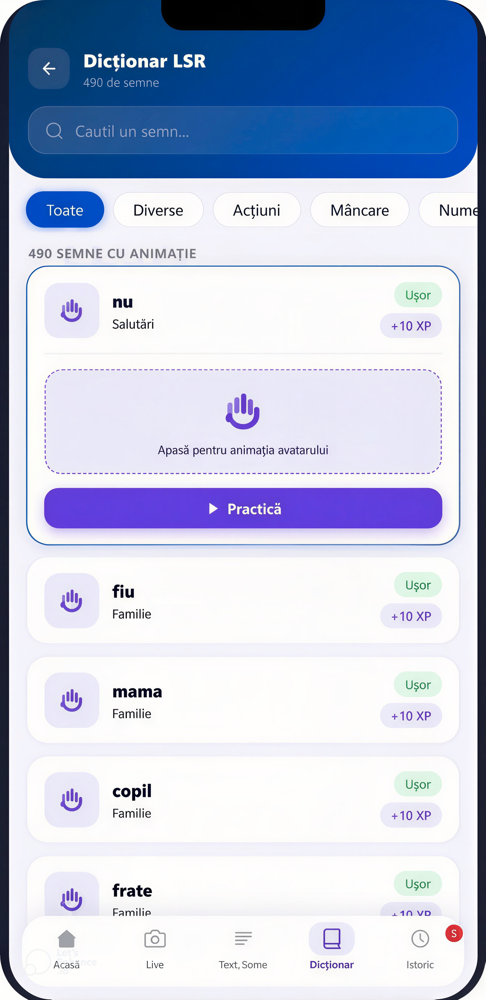
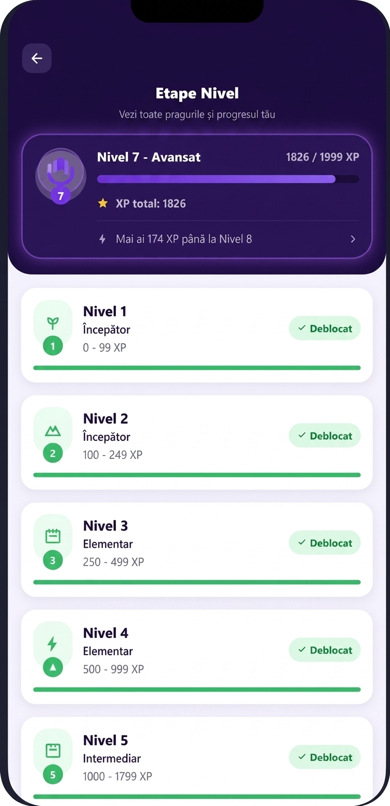
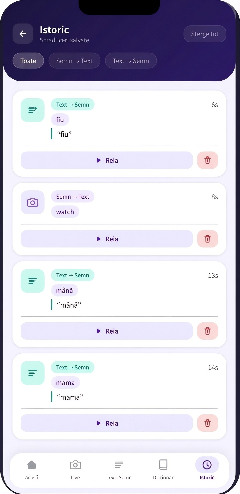

# SignTranslator

A full-stack sign language translation platform that connects computer vision, speech recognition, text-to-sign animation, and a cross-platform mobile/web interface.

The project is designed to make communication more accessible by translating sign language into text and converting written or spoken language into sign-based visual output.

## Features

- Real-time sign language recognition from camera frames
- Sign-to-text translation with confidence scores and alternative predictions
- Text-to-sign animation generation
- Speech-to-text input using Whisper
- Romanian and English dictionary support
- User authentication with JWT
- Translation history and saved sessions
- Learning progress, XP, levels, streaks, challenges, and daily rewards
- User profile and application settings
- React Native interface for Android, iOS, and web
- Flask REST API with SQLite persistence

## Demo

The project includes a recorded demonstration of the application workflow. The preview below shows the main user journey: sign recognition, text-to-sign conversion, and the resulting translation.

<p align="center">
  
</p>

The animated preview above is included directly in this README because GitHub does not reliably play MP4 files inline from a repository file page.

### Application Screens

The following screenshots present the main user flows:

| Authentication | Home and live recognition |
| --- | --- |
|  |  |
|  |  |

| Text-to-sign | Dictionary and history |
| --- | --- |
|  |  |
|  |  |

## Architecture

```text
+-------------------------------+
| React Native / React Native   |
| Web client                     |
| mobile_app/                   |
+---------------+---------------+
                |
                | HTTP / JSON
                v
+-------------------------------+
| Flask REST API                |
| backend_api/                  |
+---------------+---------------+
                |
       +--------+---------+
       |                  |
       v                  v
+--------------+   +----------------+
| SQLite       |   | AI and media   |
| user data,   |   | models,        |
| history,     |   | MediaPipe,     |
| settings     |   | OpenCV,        |
|              |   | Whisper        |
+--------------+   +----------------+
```

## Technology Stack

### Frontend

- React 18
- React Native 0.73
- React Native Web
- TypeScript
- React Navigation
- Axios
- Webpack

### Backend

- Python 3.10 or newer recommended
- Flask 3
- Flask-CORS
- Flask-SQLAlchemy
- PyTorch
- MediaPipe
- OpenCV
- OpenAI Whisper
- SQLite
- JWT-based authentication

## Repository Structure

```text
SignTranslator/
├── backend_api/                  # Flask API, recognition services, routes, and models
│   ├── api_server.py             # Application entry point
│   ├── requirements.txt          # Python dependencies
│   ├── models.py                 # Database models
│   ├── sign_recognizer.py        # Sign recognition integration
│   ├── spoter_recognizer.py      # SPOTER model integration
│   ├── dictionary_routes.py      # Dictionary endpoints
│   ├── history_routes.py         # Translation history endpoints
│   ├── gamification_routes.py   # Progress and reward endpoints
│   └── static/                   # Static assets and generated content
├── mobile_app/                   # React Native and web client
│   ├── src/screens/              # Application screens
│   ├── src/services/             # API client and service logic
│   ├── src/config/               # Runtime configuration
│   ├── App.tsx                   # Application shell and navigation
│   └── package.json              # JavaScript dependencies and scripts
├── integration/                  # Translation and dictionary utilities
├── models/                       # Trained model files and label mappings
├── training/                     # Training-related resources and scripts
├── data/                         # Dataset and preprocessing resources
├── speech2text/                  # Speech processing resources
└── README.md
```

## Prerequisites

Install the following before running the project:

- Git
- Python 3.10+
- Node.js 18+
- npm
- Android Studio and an Android emulator, or a physical Android device, for native Android development
- Xcode on macOS for iOS development
- A working C/C++ build environment may be required by some computer vision and PyTorch dependencies

The repository contains large datasets, model files, generated videos, and local virtual environments. These resources may require significant disk space and RAM.

## Installation

### 1. Clone the repository

```bash
git clone https://github.com/munteanu004/SignTranslator.git
cd SignTranslator
```

### 2. Set up the backend

Create and activate a virtual environment:

#### Windows PowerShell

```powershell
python -m venv .venv
.\.venv\Scripts\Activate.ps1
```

#### macOS/Linux

```bash
python3 -m venv .venv
source .venv/bin/activate
```

Install the backend dependencies:

```bash
python -m pip install --upgrade pip
pip install -r backend_api/requirements.txt
```

### 3. Configure the backend

The backend creates its SQLite database automatically when it starts. For production or shared deployments, set a strong JWT secret instead of using the development fallback:

#### Windows PowerShell

```powershell
$env:JWT_SECRET = "replace-with-a-long-random-secret"
```

#### macOS/Linux

```bash
export JWT_SECRET="replace-with-a-long-random-secret"
```

Do not commit real secrets, credentials, or private configuration files to GitHub.

### 4. Set up the frontend

```bash
cd mobile_app
npm install
```

## Running the Application

### Start the backend

From the repository root, with the Python virtual environment activated:

```bash
python backend_api/api_server.py
```

The API runs at:

```text
http://localhost:5000
```

Verify that it is running:

```text
GET http://localhost:5000/api/health
```

Expected response:

```json
{
  "status": "ok",
  "message": "SignTranslator API is running",
  "version": "1.0.0"
}
```

### Start the web client

In a second terminal:

```bash
cd mobile_app
npm run web
```

Open the development URL printed by Webpack, usually `http://localhost:8080`.

### Start the Android client

With an emulator running or an Android device connected:

```bash
cd mobile_app
npm start
```

In another terminal:

```bash
npm run android
```

### Start the iOS client

On macOS with Xcode installed:

```bash
cd mobile_app
npm start
```

In another terminal:

```bash
npm run ios
```

## API Configuration

The frontend reads the API base URL from `EXPO_PUBLIC_API_BASE_URL`. This is the preferred option when the backend is running on another machine or when using a deployed API.

```bash
EXPO_PUBLIC_API_BASE_URL=http://localhost:5000/api npm run web
```

For Windows PowerShell:

```powershell
$env:EXPO_PUBLIC_API_BASE_URL = "http://localhost:5000/api"
npm run web
```

For a physical mobile device, replace `localhost` with the local IP address of the computer running Flask, for example:

```text
http://192.168.1.25:5000/api
```

The device and computer must be connected to the same network, and the backend port must be allowed through the firewall.

## Main API Areas

The backend exposes REST endpoints under `/api`, including:

- `/api/health` for service status
- Authentication and user profile endpoints
- Sign recognition endpoints for camera frames and uploaded media
- Text-to-sign and avatar animation endpoints
- History endpoints for saved translations
- Dictionary endpoints for English and Romanian terms
- Settings endpoints for language and accessibility preferences
- Gamification endpoints for progress, levels, streaks, and rewards

The exact request and response formats are implemented in `backend_api/api_server.py` and the route modules in `backend_api/`.

## Machine Learning Pipeline

The recognition pipeline combines video preprocessing and pose/hand landmark extraction with trained sign language recognition models. MediaPipe and OpenCV are used for visual processing, while PyTorch-backed models produce predictions and confidence values.

The speech workflow uses Whisper to convert spoken input into text before it is passed to the text-to-sign pipeline. Model loading is performed lazily or during API startup depending on the component, so the first request can take longer while resources are initialized.

### Model and Evaluation Notes

- The live recognition fallback uses the SPOTER architecture with WLASL100 skeletal data and MediaPipe landmarks.
- `backend_api/setup_spoter.py` documents the one-time model setup and training workflow.
- `backend_api/eval_spoter.py` evaluates the SPOTER model on its validation split.
- Accuracy, latency, and live FPS should be reported only after running the evaluation and a hardware-specific benchmark. They are intentionally not presented here as fixed claims because they depend on the selected checkpoint, device, camera, and preprocessing settings.

For a reproducible performance report, record the model checkpoint, dataset split, hardware, average inference latency, live FPS, and top-1/top-5 accuracy alongside the evaluation command output.

## Testing

Run the frontend test command with:

```bash
cd mobile_app
npm test
```

Run the SPOTER validation evaluation from the backend directory with:

```bash
cd backend_api
python eval_spoter.py
```

For a basic backend smoke test, start the Flask server and request:

```text
http://localhost:5000/api/health
```

## Security and Production Notes

This project is configured primarily for local development and academic demonstration. The repository currently includes a frontend test command and a backend health-check smoke test; a full CI workflow and application-specific automated test suite are still future improvements.

Before deploying it publicly:

- Replace the development JWT secret with a securely managed secret
- Restrict CORS origins instead of allowing all origins
- Use HTTPS and secure cookie/token handling
- Add rate limiting and request-size limits
- Move generated media and persistent data to managed storage
- Review authentication, authorization, and file-upload validation
- Use a production WSGI server such as Waitress or Gunicorn
- Store model files and datasets through a release or artifact strategy when they are too large for Git

## Limitations

Recognition quality depends on lighting, camera position, signing speed, visible hands, dataset coverage, and the selected model. The available vocabulary and translation rules are limited by the included datasets and dictionaries. This project should be treated as an assistive prototype and not as a replacement for a qualified sign language interpreter.

## Project Context

SignTranslator is an academic software and machine learning project focused on accessibility, computer vision, natural language processing, and cross-platform application development.

## Contributing

Contributions are welcome. For a proposed change:

1. Fork the repository.
2. Create a feature branch.
3. Make the change and add focused tests where appropriate.
4. Open a pull request with a clear description of the motivation and implementation.

## License

This project is licensed under the [MIT License](LICENSE). Third-party datasets, model weights, and dependencies may have separate licenses and terms; review their original sources before redistribution.

## Contact

- Author: Munteanu Maria
- Email: munteanumaria105@gmail.com
- GitHub: [munteanu004](https://github.com/munteanu004)
